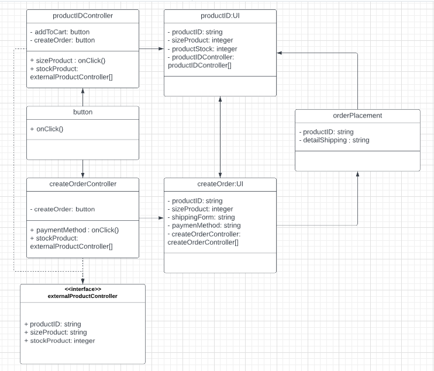
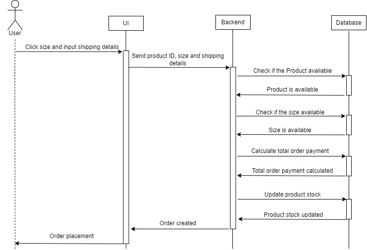

# E-Commerce Design Assignment

## High-Level System Design



For the High Level Design, i'm using Class Diagram Design, and because i can't find diamond arrow or diamond icon in lucid.app so i'm using an ordinary arrow in button class, but it has to be solid diamond arrow.

## Create Order Details and Algorithm Design



For the Create Order Details, i'm using sequence diagram because it's more understandable than the other diagram.

### Pseudocode

```
function getProductById(){
    get product details from database using id
    return product details (size, stock & price)
}

function createOrder() {
    do getProductById

    if ProductId is available {
        order create


    if sizeProduct is available {
        order create
    }

    if productStock is available {
        order create
    }

    }else{
    	order failed
    }

}

function calculateOrder(createOrder){
    let totalPrice = 0
    for product in createOrder:
    totalPrice = totalPrice + (product x price)
    productStock = 1

    return totalPrice
}

function updateProductStock(){
    if order placement{
    return productStock by reduce productStock with quantity on order
}
```

## Complexity Analysis

The Complexity Analysis for createOrder is $O(n)$ which $n$ is
the productStock in Database because its uncounted and will always updated.
